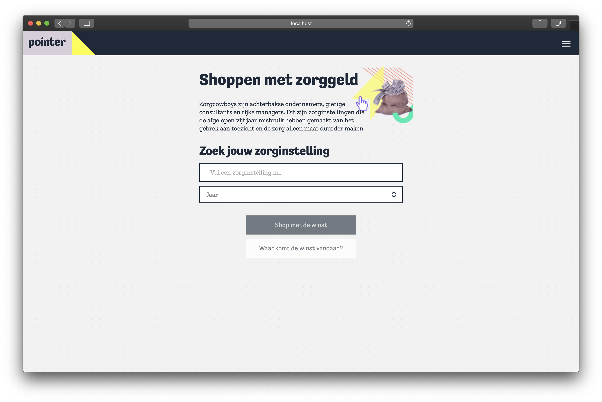

# Pointer project
[](https://app.netlify.com/sites/pointer-project/deploys)



## Features
### Shop with the profit of your healthcare institution
Users can find their own healthcare institution or an institution of interest and can shop with the profit they made in a specific year. Users can buy silly things in the webshop like a private jet or an Aston Martin supercar.

### Identify the *zorgcowboys*
At the stats page users can dive into the numbers and identify the zorgcowboys. They see how the chosen healthcare institution compares to the rest of the dataset (Nederland) and to the norm (when can we call this institution a *zorgcowboy*). This way, with some explanation about what a *zorgcowboy* is, they can identify if their chosen healthcare institution is a *zorgcowboy*.

### Dive into the revenue
Also at the stats page, in a different view, users can dive into the revenue made by their chosen healthcare institution in the chosen year.

### Spent your money, get slammed in the face
When users go to their cart, they get slammed in the face because they see how much money they spent on their silly things and see what they otherwise could do with the money by putting it back into healthcare. Like, did you know that you could help around 180.000 people with eating for a year with the money you would buy 30 Aston Martin's for?

### Share your results with your friends
You can share the results with your friends on Facebook or Twitter.

## Prerequisites
Before starting the project you should have the following things sorted out:
1. Ask us or [Pointer](https://pointer.kro-ncrv.nl/) for a raw .csv data file
2. Ask us for a dutch-data .csv file
3. Put both csv's in a `data` folder in the root of your project

You can find our email adresses at the bottom of the README.

## Getting started
```bash
# Install dependencies
npm install

# Spin up a dev server with hot-reloads for development
npm run dev

# Generate a static site for production
npm run generate
```

## Technical notes
Some technical notes about the used frameworks and libraries and out build process.

### Build process
The app gets build after you run `npm run generate`. After it runs the `pregenerate` script (which rewrites the csv files to JSON and cleanes it (more on that later)) it builds out the app and serves all in the `dist` folder which leaves you with just an index.html for every page and all static assets. The dist folder is also the folder that gets served on Netlify.

> We chose to clean the data pre-build so it doesn't have to happen on page load and therefore our website is faster than yours. - Kris Kuiper

### Libraries and frameworks used

#### Nuxt
This project is built using [Nuxt](http://nuxtjs.org/). Nuxt uses Vue components to build out your web application. With Nuxt you get server-side rendering out of the box. The first page view gets server-side rendered, therefore the user doesn't see an empty page before all JavaScript kicks in as you can see when you go to our live version.

#### Vuex
For handling app-wide state we use [Vuex](https://vuex.vuejs.org/guide/), which comes built in with Nuxt. Using such a store (you can think of it as Redux, but for Vue) makes handling state very easy. You can commit mutations to the store and map component state to store state by using `mapGetters` or `mapState`.

#### ChartJS / VueChartJS
[ChartJS](https://www.chartjs.org/) is a charting library which integrates seamlessly with Nuxt, also we used the [VueChartJS](https://vue-chartjs.org/) library to implement our bar and stacked bar-chart components.

VueChartJS makes it easy to build out the charts while still using the Vue spec for building out a `bar-chart` component for example.

### Hosting
The application is proudly hosted on [Netlify](https://www.netlify.com/). We can do this because Nuxt serves out a static site when running `nuxt generate`.

## Cleaning the data
If you want to read all about our data-cleaning process you can take a look at [our wiki](https://github.com/kriskuiper/pointer-project/wiki/Data-Cleaning).

## Collaboration
### Branches
Branch names should have the following prefixes:
- `feat/`: a branch that adds new functionality
- `docs/`: a branch that adds documentation
- `fix/`: a branch that resolves bugs

### Commit messages
We like to apply to the Angular JS commit message conventions. You can find the docs [here](https://gist.github.com/stephenparish/9941e89d80e2bc58a153).

### Pull Requests
I've written a PR template for this project, you should use that at all times. Right now it's written in Dutch, you can also translate it to English.

### Small style guide
A small style guide to improve consistency in the project.

#### File names
You should always use `kebab-case` in file names. Also if you create a `lib` function.

#### Vue component names
Vue component names can be written in a number of different ways. We prefer to use `PascalCase` after an import statement and in the `components` section of a Vue component. In the Vue template, we use `kebab-case` to make it web component-like, like so:

```js
// After import
import MyAwesomeComponent from 'components/my-awesome-component'

// In components section
components: {
    MyAwesomeComponent
}

// In Vue template
<template>
    <my-awesome-component>
</template>
```

In this way the template stays close to HTML web-component spec.

## Authors
- Kris Kuiper ([kriskuiper74@gmail.com](mailto:kriskuiper74@gmail.com))
- Deanna Bosschert ([deanna.bosschert@gmail.com](mailto:deanna.bosschert@gmail.com))
